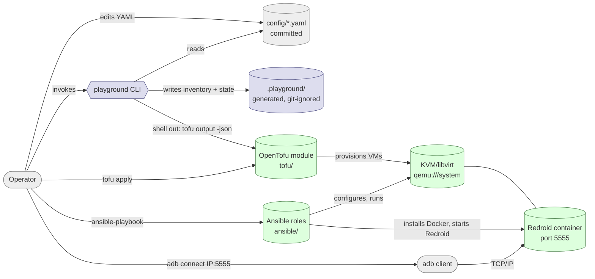
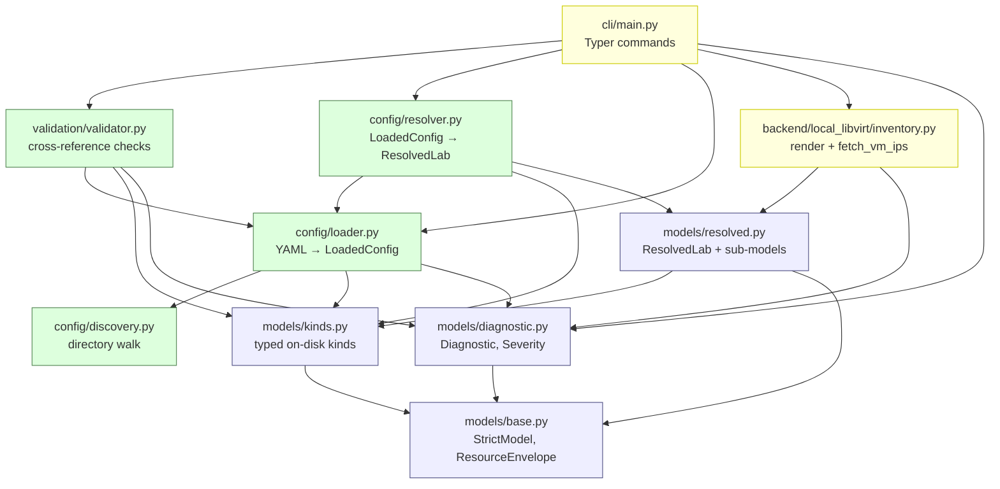
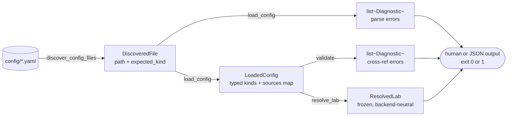
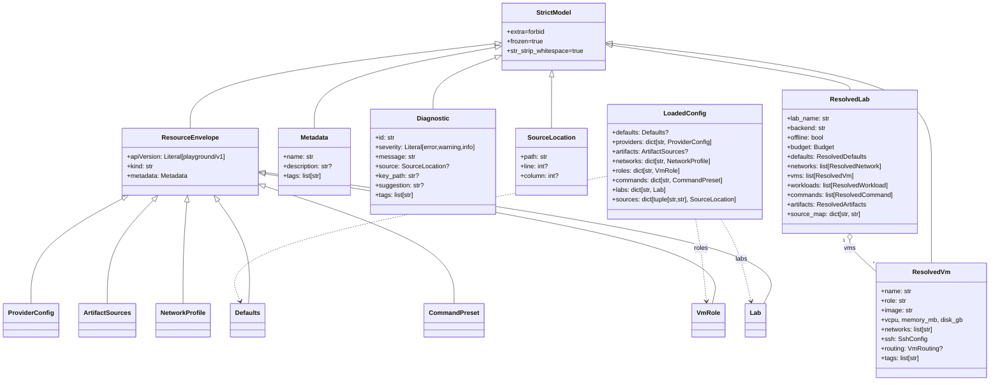
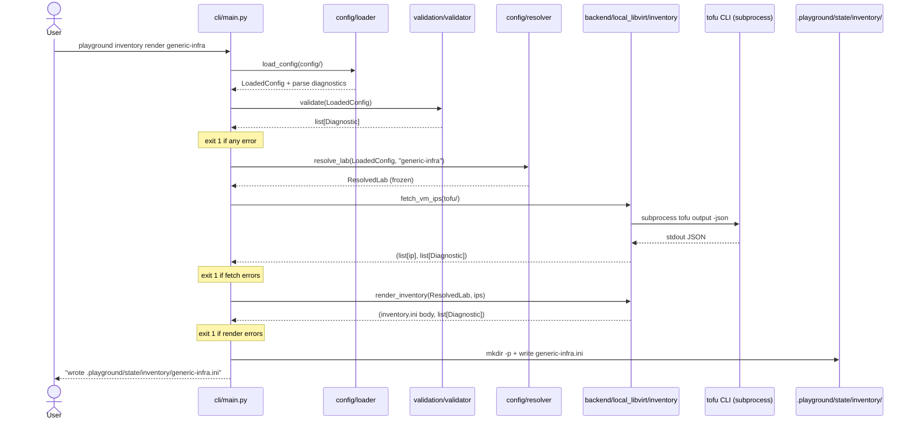
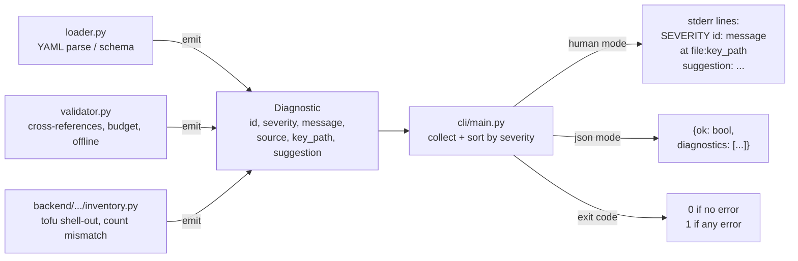

# System Overview

This is the visual companion to [`docs/system_design.md`](system_design.md) and
[`docs/developer_guide.md`](developer_guide.md). If you're skimming the project
for the first time, read this top-to-bottom: it lays out *where things live*,
*who depends on whom*, and *what happens when an operator runs a command* —
without forcing you through 600 lines of prose first.

Mermaid diagrams render natively in GitHub's Markdown viewer.

---

## 1. System context — who talks to what

**Read it as two layers**:

- **Control layer (blue)** is the Python CLI and the generated state under
  `.playground/`. Read-only today: it inspects YAML and (since roadmap §4)
  renders an Ansible inventory from `tofu output -json`.
- **Runtime baseline (green)** is the OpenTofu/Ansible/libvirt/Redroid stack
  the operator drives manually with `tofu apply` + `ansible-playbook` + `adb
  connect`. The control layer does **not** drive it yet — that's the bridge
  being built incrementally.

The only crossing between the two today is `playground inventory render`
shelling out to `tofu output -json` to discover VM IPs.

---

## 2. Module dependency graph — where the Python code lives

The graph is **strictly bottom-up** — arrows always point from higher layers to
lower ones, never back. That's the contract: nothing in `models/` may import
from `config/`, nothing in `config/` may import from `validation/` or
`backend/`, etc. mypy will catch a violation but the rule is also a design
discipline — it keeps `ResolvedLab` consumable by any future adapter without
circular imports.

Placeholder modules under `src/playground/{events,logging,runs,state}/` are
not on the graph — they're empty reservations for upcoming roadmap items.

---

## 3. Pipeline — what happens when you run `playground validate`

Three things to notice:

- **Every stage emits `Diagnostic`s, not exceptions.** A YAML parse failure
  doesn't abort the load; subsequent files still parse so the operator sees
  every problem in one run. Resolver-side exceptions (`KeyError` / `ValueError`)
  are reserved for "you tried to resolve without validating first" contract
  violations.
- **`validate` and `resolve_lab` both read `LoadedConfig`** — they're peers,
  not a chain. The validator never produces a `ResolvedLab`; the resolver
  never produces diagnostics. This keeps each module small and testable in
  isolation.
- **`source_map` on `LoadedConfig` and `ResolvedLab`** is how diagnostics
  carry real `config/foo/bar.yaml` paths even when `metadata.name` differs
  from the filename (roadmap §3 closed this).

---

## 4. Class diagram — the key types

Three families:

- **`StrictModel`** is the common base — `extra="forbid"`, `frozen=True`,
  `str_strip_whitespace=True`. Every typed model inherits it. Two intentional
  escape hatches exist (`ProviderConfig.spec` and `LabProviders` use
  `extra="allow"`) because backend adapters version their own schemas.
- **The seven `ResourceEnvelope` subclasses** are the on-disk kinds. Each
  is one YAML file's worth of intent.
- **`LoadedConfig`** is a plain dataclass (not a `StrictModel`) — it's the
  mutable internal container the loader fills and the validator/resolver
  read. `ResolvedLab` is the frozen, backend-neutral output the future
  adapters consume.

`Diagnostic` is the universal feedback channel — every layer either returns
a `list[Diagnostic]` or a `(value, list[Diagnostic])` tuple.

---

## 5. Sequence — `playground inventory render generic-infra`

Notice the **diagnostic gates between every stage** — the CLI never proceeds
past an error. The `fetch_vm_ips` / `render_inventory` split is deliberate:
the outer function does I/O (subprocess), the inner is a pure function. That
same shape will replay when `plan` and `apply` adapters arrive.

---

## 6. Diagnostic lifecycle — what an operator actually sees

Diagnostic IDs are namespaced like `config.<category>.<specific>`. The
**full registry** lives in the docstrings of the modules that emit them —
`loader.py`, `validator.py`, `backend/local_libvirt/inventory.py`. Today's
categories:

| Category | Where emitted | Examples |
|---|---|---|
| `config.yaml.*` | loader | `parse_failed` |
| `config.schema.*` | loader | `kind_missing`, `kind_mismatch`, `unknown_kind`, `validation_failed` |
| `config.identity.*` | loader | `duplicate_name` |
| `config.required.*` | validator | `defaults_missing` |
| `config.reference.*` | validator | `unknown_role`, `unknown_network`, `unknown_command`, `unknown_provider`, `unknown_image`, `unknown_network_profile`, `unknown_workload_target`, `ansible_role_missing` |
| `config.role.*` | validator | `inheritance_cycle`, `unknown_extends` |
| `config.budget.*` | validator | `exceeded` |
| `config.artifact.*` | validator | `offline_missing` |
| `config.backend.*` | validator | `per_vm_resources_unsupported` |
| `config.inventory.*` | backend | `tofu_binary_missing`, `tofu_command_failed`, `tofu_parse_failed`, `tofu_no_state`, `vm_ip_not_found` |
| `config.discovery.*` | CLI | `not_directory` |
| `config.lab.*` | CLI | `unknown`, `resolve_failed` |

Diagnostic IDs are **stable public contract** — they show up in JSON output
that downstream tools may grep. Don't rename without a deprecation plan.

---

## 7. Roadmap state on this map

```mermaid
flowchart LR
    s1[§1 Baseline Cleanup]
    s2[§2 Read-Only CLI<br/>validate / lab list / lab show]
    s3[§3 Validation Hardening<br/>defaults / workload / budget /<br/>offline / source paths]
    s4a[§4a Inventory Bridge<br/>tofu output → .playground/]
    s4b[§4b Name-keyed vm_ips]
    s4c[§4c Per-role groups]
    s5[§5 Plan rendering]
    s6[§6 Apply / status / destroy]
    s7[§7 Operation runs + events]
    s8[§8 Docker workloads]
    s9[§9 TUI]

    s1 --> s2 --> s3 --> s4a --> s4b
    s4a --> s4c
    s4b --> s4d[§4d Auto-generate<br/>terraform.tfvars]
    s4b --> s5
    s4c --> s5
    s4d --> s5
    s5 --> s6 --> s7 --> s8 --> s9

    classDef done fill:#cfc,stroke:#383
    classDef next fill:#ffd,stroke:#cc0
    classDef queued fill:#eee,stroke:#888
    class s1,s2,s3,s4a,s4b,s4c,s4d,s5 done
    class s6 next
    class s7,s8,s9 queued
```

Done is green; the two immediate follow-ups inside §4 are yellow. Everything
right of those is queued and intentionally not designed in detail yet —
each will get its own architect pass when it's the head of the queue.

See [`docs/roadmap.md`](roadmap.md) for the authoritative status and detail.

---

## Where to read next

- Code-level deep dive: [`docs/developer_guide.md`](developer_guide.md)
- Full intended system in prose: [`docs/system_design.md`](system_design.md)
- Non-negotiable design decisions: [`docs/architecture_decisions.md`](architecture_decisions.md)
- Implementation principles: [`docs/engineering_principles.md`](engineering_principles.md)
- Product intent (highest signal): [`docs/product/requirements.md`](product/requirements.md)
