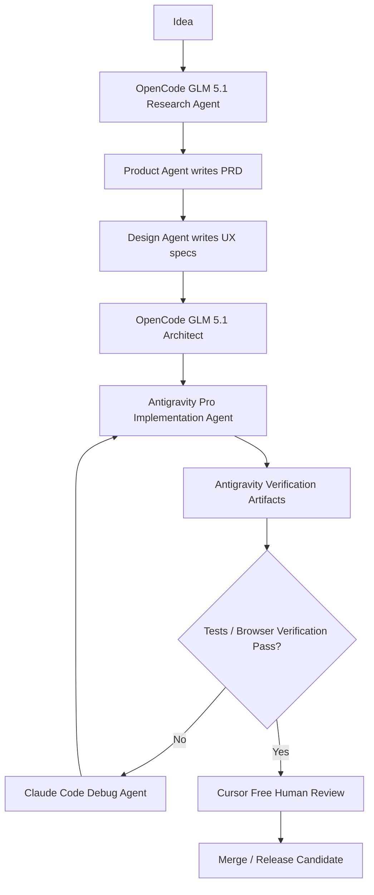

```text
OpenCode + GLM 5.1  = deep reasoning / architecture / research synthesis
Antigravity Pro     = main autonomous IDE-agent execution layer
Claude Code         = repo-local coding/debugging specialist
Codex               = focused patch generation / second-opinion implementation
Cursor Free         = lightweight human review, editing, and code navigation
Superset            = orchestration/state dashboard, not primary IDE
```

Antigravity is especially relevant here because it is positioned as an **agent-first development platform** with agents that can work across editor, terminal, and browser, plus a Manager/Mission Control style view for running agents across workspaces. It also supports MCP integration, so it can participate in the same Tavily + Filesystem context system as the other tools. ([Google Codelabs][1])

## Updated routing

### Cursor Free becomes “review surface,” not orchestration

Use Cursor for:

```text
- reading code
- small manual edits
- reviewing diffs
- applying final polish
- using .cursor/rules as shared coding policy
```

Do **not** rely on Cursor Free for:

```text
- long autonomous coding sessions
- multi-agent orchestration
- heavy repo refactors
- large-context architectural work
```

### Antigravity Pro becomes your main IDE agent

Use Antigravity for:

```text
- running implementation agents
- coordinating work across editor, terminal, and browser
- verifying UI behavior
- producing artifacts: plans, task lists, screenshots, test evidence
- executing implementation slices after architecture is ready
```

This replaces the earlier role I gave to Cursor as the human-in-the-loop IDE-agent surface.

So the new pipeline is:

```text
Idea
  ↓
OpenCode GLM 5.1: Research + Product + Architecture
  ↓
Antigravity Pro: implementation planning, coding, browser verification
  ↓
Claude Code: difficult repo-local fixes, test failures, refactors
  ↓
Codex: focused alternative patches or isolated implementation
  ↓
Cursor Free: final manual review and navigation
  ↓
QA / merge
```

## Revised handoff point

Previously:

```text
Architecture → Claude Code takes over
```

Now:

```text
Architecture → Antigravity takes over as primary executor
```

Claude Code should take over only when:

```text
- Antigravity gets stuck on a local repo issue
- test failures require deep debugging
- a refactor needs precise multi-file edits
- you want an independent implementation review
```

## New practical split

| Phase              | Primary tool                  | Secondary tool            |
| ------------------ | ----------------------------- | ------------------------- |
| Research           | OpenCode GLM 5.1 + Tavily MCP | Antigravity browser agent |
| PRD / roadmap      | OpenCode GLM 5.1              | Claude                    |
| UX flows           | Antigravity / Claude          | Cursor Free               |
| Architecture       | OpenCode GLM 5.1              | Claude Code               |
| Implementation     | **Antigravity Pro**           | Claude Code               |
| Debugging          | Claude Code                   | OpenCode GLM 5.1          |
| UI verification    | **Antigravity Pro**           | Cursor                    |
| Patch alternatives | Codex                         | Claude Code               |
| Final human review | Cursor Free                   | Git diff / PR             |

## Updated “Working Pipeline”



## Antigravity-specific operating rule

Because Antigravity can operate more autonomously, give it stricter guardrails:

```md
# Antigravity Agent Rules

Before acting:
1. Read ai/global_context.md
2. Read ai/agents_state.md
3. Read ai/engineering/implementation_plan.md
4. Confirm the current implementation slice

Allowed:
- edit project files
- run tests
- run local app
- use browser verification
- create screenshots or verification artifacts
- update ai/agents_state.md

Not allowed without explicit approval:
- delete large directories
- run destructive shell commands
- modify secrets
- change deployment infrastructure
- force push
- rewrite git history
- change architecture without ADR
```

This matters because autonomous IDE agents can execute terminal actions. There have already been public reports of destructive behavior when high-autonomy modes were allowed to run shell commands too freely, so I would keep destructive commands behind manual confirmation. ([TechRadar][2])

## Updated repo config layout

Add Antigravity-specific rules:

```text
repo/
  ai/
    global_context.md
    agents_state.md
    handoffs/
    research/
    product/
    design/
    architecture/
    engineering/
    qa/

  .antigravity/
    rules.md
    agents/
      implementation.md
      verifier.md
      debugger.md

  .claude/
    agents/
      debugger.md
      qa-engineer.md
      code-reviewer.md

  .cursor/
    rules/
      ai-workflow.mdc

  .opencode.json
  OPENCODE.md
  CLAUDE.md
  ANTIGRAVITY.md
```

## `ANTIGRAVITY.md`

```md
# Antigravity Project Instructions

You are the primary implementation and verification agent for this repository.

## Required context before work

Always read:

- ai/global_context.md
- ai/agents_state.md
- ai/engineering/implementation_plan.md
- ai/architecture/system_design.md
- ai/architecture/api_contracts.md

## Workflow

1. Select only the current implementation slice.
2. Create a task plan.
3. Implement the smallest useful change.
4. Run relevant tests.
5. Run the app if applicable.
6. Verify behavior in browser if UI is affected.
7. Save verification artifacts.
8. Update ai/agents_state.md.
9. Write a summary of changed files and commands run.

## Rules

Do not:
- modify unrelated files
- silently change requirements
- silently change architecture
- delete broad directories
- rewrite git history
- touch secrets or credentials
- skip tests because they are inconvenient

If architecture must change:
- stop
- create an ADR in ai/decisions/
- update ai/global_context.md
```

## Where Superset fits now

Superset should track state, not drive code directly:

```text
Superset dashboard:
- current phase
- active agent
- open handoffs
- failing tests
- current branch
- last artifact
- blockers
- risks
```

It can read from:

```text
ai/agents_state.md
ai/handoffs/*.md
ai/qa/regression_report.md
git log
test output artifacts
```

## Bottom line

Your new best setup is:

```text
OpenCode GLM 5.1 = brain
Antigravity Pro = hands + eyes
Claude Code = local debugging specialist
Codex = patch generator / alternative implementer
Cursor Free = review cockpit
Superset = status board
MCP = shared nervous system
/ai folder = memory
```

